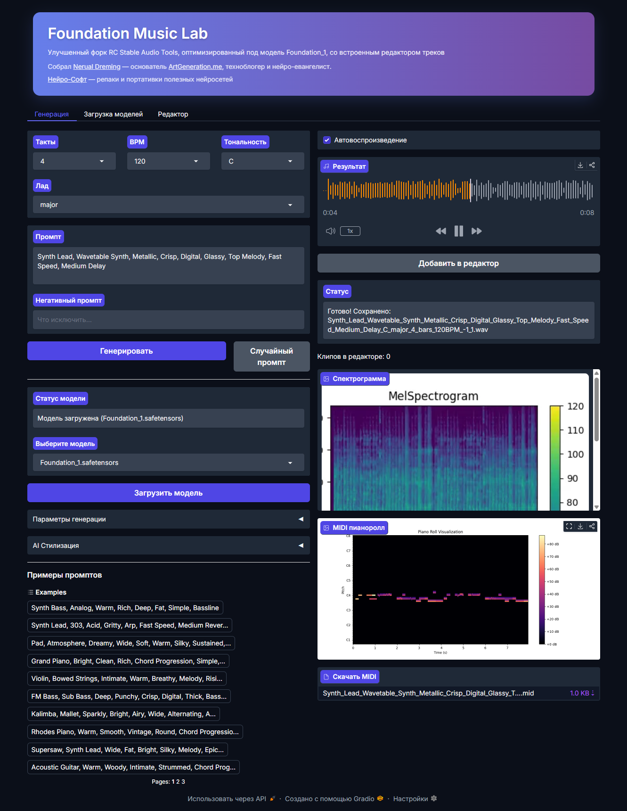
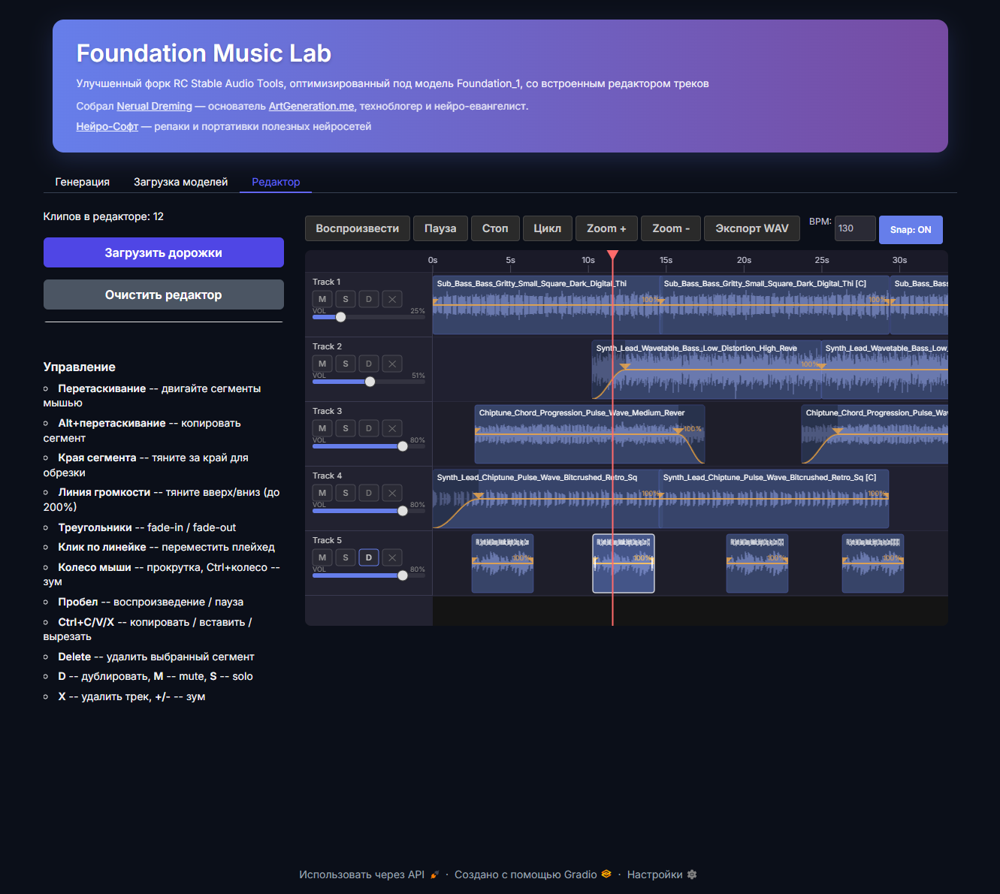

# Foundation Music Lab

[](https://github.com/timoncool/Foundation-Music-Lab/stargazers)
[](LICENSE)

Улучшенный и оптимизированный под модель Foundation_1 форк [RC Stable Audio Tools](https://github.com/RoyalCities/RC-stable-audio-tools) со встроенным редактором треков.

Портативная русскоязычная версия для Windows.

## Скриншоты

### Генерация музыки


### Таймлайн-редактор


## Возможности

- Генерация музыки по текстовому промпту (оптимизация под Foundation_1)
- Встроенный таймлайн-редактор треков (мульти-трек до 20 дорожек, drag & drop, экспорт WAV)
- Snap к сетке битов (BPM) и краям сегментов
- Громкость на каждый сегмент (0-200%) с изменением в реальном времени
- Fade-in / Fade-out с визуальными ручками
- Clipboard (Ctrl+C/V/X), дублирование (D), Alt+drag копирование
- Выбор BPM, тональности, количества тактов
- AI стилизация (Style Transfer)
- MIDI-экспорт + визуализация пианоролла
- Спектрограмма
- Загрузка моделей из HuggingFace прямо в интерфейсе

## Системные требования

| Компонент | Минимум | Рекомендуется |
|-----------|---------|---------------|
| OS | Windows 10 x64 | Windows 11 x64 |
| GPU | GTX 1060 6GB | RTX 3060 12GB+ |
| RAM | 8 GB | 16 GB |
| Диск | 5 GB | 10 GB |
| Git | Обязательно | - |

## Совместимость видеокарт

| Серия | CUDA | Поддержка |
|-------|------|-----------|
| GTX 10xx (Pascal) | 11.8 | Базовая |
| RTX 20xx (Turing) | 11.8 | Базовая |
| RTX 30xx (Ampere) | 12.6 | + Flash Attention 2 |
| RTX 40xx (Ada) | 12.8 | + Flash Attention 2 |
| RTX 50xx (Blackwell) | 12.8 | + Flash Attention 2 |

## Установка

1. Установите [Git](https://git-scm.com/downloads) если ещё не установлен
2. Скачайте архив из [Releases](../../releases) или клонируйте репозиторий:
   ```
   git clone https://github.com/timoncool/Foundation-Music-Lab.git
   ```
3. Запустите `install.bat`
4. Выберите вашу видеокарту
5. Дождитесь завершения установки

## Запуск

Запустите `run.bat` — приложение откроется в браузере автоматически.

При первом запуске выберите и скачайте модель в интерфейсе (вкладка "Загрузка моделей").

## Обновление

Запустите `update.bat` для обновления приложения и библиотеки.

## Структура папок

```
Foundation-Music-Lab/
├── app.py              — основной файл приложения
├── editor/             — таймлайн-редактор
├── install.bat          — установщик
├── run.bat              — запуск
├── update.bat           — обновление
├── python/              — портативный Python (создаётся при установке)
├── RC-stable-audio-tools/ — библиотека (клонируется при установке)
├── models/              — модели HuggingFace
├── generations/         — сгенерированные аудио
├── cache/               — кэш
└── temp/                — временные файлы
```

## Полная изоляция

Приложение полностью изолировано:
- Портативный Python 3.10.11 (не требует установки в систему)
- Все модели, кэш и временные файлы хранятся в папке приложения
- Не загрязняет системные директории
- Можно перенести на другой компьютер простым копированием

## Доступные модели

- **Foundation-1** — универсальная генерация музыки
- **RC Infinite Pianos** — фортепианная музыка
- **Stable Audio Open 1.0** — открытая модель
- **Vocal Textures Main** — вокальные текстуры
- **Audialab EDM Elements** — EDM элементы

## Другие портативные нейросети

| Проект | Описание |
|--------|----------|
| [VibeVoice ASR](https://github.com/timoncool/VibeVoice_ASR_portable_ru) | Распознавание речи (ASR) |
| [LavaSR](https://github.com/timoncool/LavaSR_portable_ru) | Улучшение качества аудио |
| [Qwen3-TTS](https://github.com/timoncool/Qwen3-TTS_portable_rus) | Синтез речи (TTS) от Qwen |
| [SuperCaption Qwen3-VL](https://github.com/timoncool/SuperCaption_Qwen3-VL) | Генерация описаний изображений |
| [VideoSOS](https://github.com/timoncool/videosos) | AI-видеопродакшн в браузере |

## Авторы

- **@Nerual Dreming** ([t.me/nerual_dreming](https://t.me/nerual_dreming)) — [neuro-cartel.com](https://neuro-cartel.com) | основатель [ArtGeneration.me](https://artgeneration.me)
- **Нейро-Софт** ([t.me/neuroport](https://t.me/neuroport)) — репаки и портативки нейросетей
- **RoyalCities** — оригинальный проект RC-stable-audio-tools
- **Stability AI** — модель Stable Audio

---

> **Если проект полезен — поставьте звёздочку!** Это помогает другим находить проект и мотивирует на развитие.

<a href="https://star-history.com/#timoncool/Foundation-Music-Lab&Date">
  <picture>
    <source media="(prefers-color-scheme: dark)" srcset="https://api.star-history.com/svg?repos=timoncool/Foundation-Music-Lab&type=Date&theme=dark" />
    <source media="(prefers-color-scheme: light)" srcset="https://api.star-history.com/svg?repos=timoncool/Foundation-Music-Lab&type=Date" />
    
  </picture>
</a>
